# PIDMS 企业管理系统 · 数据库设计文档

| 项 | 内容 |
| --- | --- |
| 系统名称 | 企业管理系统（PIDMS） |
| 数据库 | MySQL 8.x（InnoDB，utf8mb4_general_ci） |
| 文档版本 | V1.1 |
| 编制日期 | 2026-08-26（V1.1 修订于 2026-09-14） |
| 适用范围 | 全量四大域：系统管理、项目管理、施工管理、基础管理 |
| 配套脚本 | `database/init/01_create_database.sql`、`02_schema.sql`、`03_seed.sql` 增量：`database/upgrade/11_basic_management.sql`、`12_seed_basic_management.sql` |

---

## 1. 概述

本设计承接《PIDMS 接口文档》与前端工程（`PIDMS前端/`），为后端开发提供建表依据。前端采用「配置驱动通用 CRUD」，数据层与接口文档同构；本库表结构与接口字段一一对应，后端接入后将 `CONFIG.useMock` 置为 `false` 即可切换到真实数据库。

**范围**：共四大域 **39 张表**（`init/` 29 张 + `upgrade/11` 增量 10 张）：

- **系统管理（sys_，9 张）**：机构、角色、用户、用户角色、角色权限、字典类型、字典数据、附件、操作日志
- **项目管理（pm_，7 张）**：项目、项目预算（一期单行平面，明细子表预留二期）、项目文档、项目状态、印章类型、用印申请
- **施工管理（cm_，13 张）**：进度、质量检查/检查项/检查明细/整改/整改明细、安全检查/检查项/检查明细/整改/整改明细、施工日志、预警规则
- **基础管理（bas_，10 张）**：基础资料、客户、供应商、内部单位、工种类型、预算类型、公司文档、出差申请、请假申请、补卡申请

**V1.1 修订说明（2026-09-14）**：基础管理域 10 张表已按 §7 规划的表名通过增量脚本落地，本版补齐 §3 映射、§4 ER、§5.4 表结构明细与 §6 字典登记；同时把 `sys_user.gender` 与 `gender` 字典的存量中文值（男/女）归一为英文 code（male/female），与「枚举存 code」约定对齐。

**暂缓范围**：导出 / 导入类接口、角色权限分配与用户分配（`sys_role_permission` 表结构已建，一期不做读写），以及 `pm_project_budget_item` 明细子表（一期不读写）。

---

## 2. 设计约定

### 2.1 命名规范

| 项 | 约定 | 示例 |
| --- | --- | --- |
| 库名 | 小写，业务名 | `pidms` |
| 表名 | 域前缀 + 下划线 + 业务名 | `sys_org`、`pm_project`、`cm_quality_inspection` |
| 字段名 | 小写驼峰，单词间下划线 | `project_code`、`completion_percent` |
| 主键 | `id BIGINT UNSIGNED AUTO_INCREMENT` | — |
| 外键 | 被引用表名 + `_id` | `project_id`、`seal_type_id` |

### 2.2 公共审计字段

每张业务表统一包含以下字段（与接口文档 §2.5 一致）：

| 字段 | 类型 | 说明 |
| --- | --- | --- |
| `id` | `BIGINT UNSIGNED` | 主键，自增 |
| `create_by` | `VARCHAR(50)` | 创建人 |
| `create_time` | `DATETIME` | 创建时间，默认 `CURRENT_TIMESTAMP` |
| `update_by` | `VARCHAR(50)` | 最后修改人 |
| `update_time` | `DATETIME` | 最后修改时间，`ON UPDATE CURRENT_TIMESTAMP` |

> 纯关联表（`sys_user_role`、`sys_role_permission`）仅保留 `create_by / create_time`。

### 2.3 类型约定

| 场景 | 类型 |
| --- | --- |
| 金额 | `DECIMAL(18,2)` |
| 百分比 | `DECIMAL(5,2)`（0–100） |
| 日期 / 时间 | `DATE` / `DATETIME` |
| 长文本 | `TEXT` / `VARCHAR(1000)` |
| 图片/多附件 | 业务表存 JSON 路径数组或经 `sys_attachment` 统一管理 |
| 枚举/字典 | `VARCHAR(20~50)`，**存 code 值**，标签查 `sys_dict_data` |

### 2.4 枚举存 code

所有枚举字段在业务表中存储**英文 code**（接口文档 §2.6 通用枚举），展示时关联字典表取中文标签。例如 `pm_project.project_status = 'in-progress'`，字典 `project_status` 下 `in-progress → 在建`。未在接口文档定义 code 的少量枚举（如用印方式、天气）直接存中文值，同样登记在字典表中。

### 2.5 外键与删除策略

- 建物理外键保证引用完整性；所有外键列已建索引。
- 主表删除时，明细/关联子表按 `ON DELETE CASCADE` 级联（预算明细、检查明细、整改明细、用户-角色、角色-权限）。
- 业务上对「项目、印章类型、检查项」等使用**封存（sealed）**代替物理删除，避免破坏历史引用。

### 2.6 字符集与引擎

- `ENGINE=InnoDB`，`utf8mb4_general_ci`，兼容中文与 Emoji。

---

## 3. 模块 ↔ 表 映射

| 功能域 | 前端模块 | 表 |
| --- | --- | --- |
| 系统管理 | 机构管理 | `sys_org` |
| 系统管理 | 角色管理 | `sys_role` + `sys_role_permission` |
| 系统管理 | 人员管理 | `sys_user` + `sys_user_role` |
| 系统管理 | （基础设施） | `sys_dict_type` / `sys_dict_data` / `sys_attachment` / `sys_operation_log` |
| 项目管理 | 项目 | `pm_project` |
| 项目管理 | 项目预算 | `pm_project_budget`（一期；`pm_project_budget_item` 预留二期） |
| 项目管理 | 项目文档 | `pm_project_doc` |
| 项目管理 | 项目状态 | `pm_project_status` |
| 项目管理 | 印章类型 | `pm_seal_type` |
| 项目管理 | 用印申请 | `pm_seal_application` |
| 施工管理 | 进度管理 | `cm_progress` |
| 施工管理 | 质量检查 | `cm_quality_inspection` + `cm_quality_inspection_item` |
| 施工管理 | 质量检查项 | `cm_quality_check_item` |
| 施工管理 | 质量整改单 | `cm_quality_rectification` + `cm_quality_rectification_item` |
| 施工管理 | 安全检查 | `cm_safety_inspection` + `cm_safety_inspection_item` |
| 施工管理 | 安全检查项 | `cm_safety_check_item` |
| 施工管理 | 安全整改单 | `cm_safety_rectification` + `cm_safety_rectification_item` |
| 施工管理 | 施工日志 | `cm_construction_log` |
| 施工管理 | 预警规则 | `cm_warning_rule` |
| 基础管理 | 基础资料 | `bas_basic_info` |
| 基础管理 | 客户 | `bas_customer` |
| 基础管理 | 供应商 | `bas_supplier` |
| 基础管理 | 内部单位 | `bas_internal_unit` |
| 基础管理 | 工种类型 | `bas_work_type` |
| 基础管理 | 预算类型 | `bas_budget_type` |
| 基础管理 | 公司文档 | `bas_company_doc` |
| 基础管理 | 出差申请 | `bas_business_trip` （→ `pm_project`） |
| 基础管理 | 请假申请 | `bas_leave_application` |
| 基础管理 | 补卡申请 | `bas_makeup_application` |

---

## 4. ER 关系总览

```mermaid
erDiagram
    sys_org ||--o{ sys_org : "上级机构"
    sys_org ||--o{ sys_user : "所属机构"
    sys_user ||--o{ sys_user_role : "拥有"
    sys_role ||--o{ sys_user_role : "分配"
    sys_role ||--o{ sys_role_permission : "配置"

    pm_project ||--o{ pm_project_budget : "预算"
    %% pm_project_budget_item：一期预留不读写，二期「多行明细」启用后再建模
    pm_project ||--o{ pm_project_doc : "文档"
    pm_project ||--o{ pm_seal_application : "用印"
    pm_seal_type ||--o{ pm_seal_application : "印章类型"

    pm_project ||--o{ cm_progress : "进度"
    pm_project ||--o{ cm_quality_inspection : "质量检查"
    pm_project ||--o{ cm_quality_rectification : "质量整改"
    cm_quality_check_item ||--o{ cm_quality_inspection_item : "明细引用"
    cm_quality_inspection ||--o{ cm_quality_inspection_item : "包含检查项"
    cm_quality_inspection ||--o{ cm_quality_rectification : "整改来源"

    pm_project ||--o{ cm_safety_inspection : "安全检查"
    pm_project ||--o{ cm_safety_rectification : "安全整改"
    cm_safety_check_item ||--o{ cm_safety_inspection_item : "明细引用"
    cm_safety_inspection ||--o{ cm_safety_inspection_item : "包含检查项"
    cm_safety_inspection ||--o{ cm_safety_rectification : "整改来源"

    pm_project ||--o{ cm_construction_log : "施工日志"
    pm_project ||--o{ cm_warning_rule : "预警规则"

    pm_project ||--o{ bas_business_trip : "出差申请"
    %% bas_customer / bas_supplier / bas_internal_unit / bas_work_type /
    %% bas_budget_type / bas_basic_info / bas_company_doc /
    %% bas_leave_application / bas_makeup_application：
    %% 均为独立档案 / 申请类表，除 bas_business_trip 外无外键关联
```

> 关键业务关系：
> - **项目**是所有业务记录的根实体（进度、检查、整改、日志、预算、用印、文档、预警、出差申请均挂在项目下）。
> - **检查单 → 检查明细 → 检查项** 形成「一次检查多明细」的父子结构；整改单通过 `related_inspection_id` 关联检查单，整改明细再回引检查项。
> - **用户 ↔ 角色** 为多对多；角色权限存 `permission_code`（模块:操作），与前端角色管理「权限设置」对应。
> - **基础管理域**中，客户 / 供应商 / 内部单位 / 工种类型 / 预算类型 / 基础资料 / 公司文档 为纯档案表（无外键，靠 `status` 封存代替删除）；出差 / 请假 / 补卡 为申请类表，共用 `approval_status`（pending/approved/rejected）流转，其中只有出差申请通过 `project_id` 挂到项目。

---

## 5. 表结构明细

> 公共审计字段（`create_by / create_time / update_by / update_time`）以下省略列示，见 §2.2。`id` 均为主键自增，省略行首 `id`。

### 5.1 系统管理域

#### 5.1.1 `sys_org` 机构表
| 字段 | 类型 | 可空 | 默认 | 说明 |
| --- | --- | --- | --- | --- |
| `parent_id` | BIGINT UNSIGNED | 是 | NULL | 上级机构ID，顶级为NULL（自引用外键） |
| `org_code` | VARCHAR(50) | 否 | — | 机构编码，**唯一** |
| `org_name` | VARCHAR(100) | 否 | — | 机构名称 |
| `sort_order` | INT | 否 | 0 | 排序 |
| `description` | VARCHAR(500) | 是 | NULL | 描述 |
| `status` | VARCHAR(20) | 否 | enabled | enabled启用 / disabled停用 |

索引：`uk_org_code`、`idx_parent_id`。

#### 5.1.2 `sys_role` 角色表
| 字段 | 类型 | 可空 | 默认 | 说明 |
| --- | --- | --- | --- | --- |
| `role_code` | VARCHAR(50) | 否 | — | 角色编码，**唯一**（ADMIN/PM/ENGINEER/STAFF） |
| `role_name` | VARCHAR(50) | 否 | — | 角色名称 |
| `role_description` | VARCHAR(500) | 是 | NULL | 角色描述 |
| `status` | VARCHAR(20) | 否 | enabled | enabled启用 / disabled禁用 |

索引：`uk_role_code`。

#### 5.1.3 `sys_user` 用户表（人员管理）
| 字段 | 类型 | 可空 | 默认 | 说明 |
| --- | --- | --- | --- | --- |
| `name` | VARCHAR(50) | 否 | — | 姓名 |
| `username` | VARCHAR(50) | 是 | NULL | 登录账号，**唯一**；由 `upgrade/05_add_login_columns.sql` 增量补入 |
| `password` | VARCHAR(100) | 是 | NULL | 登录密码（BCrypt 哈希）；由 `upgrade/05_add_login_columns.sql` 增量补入 |
| `gender` | VARCHAR(10) | 是 | NULL | 性别：male男 / female女（存量中文值已在 `upgrade/11` 归一） |
| `employee_no` | VARCHAR(50) | 否 | — | 工号，**唯一** |
| `phone` | VARCHAR(20) | 是 | NULL | 电话 |
| `org_id` | BIGINT UNSIGNED | 是 | NULL | 所属机构ID → `sys_org.id` |
| `status` | VARCHAR(20) | 否 | enabled | enabled在职 / disabled离职 |
| `image` | VARCHAR(255) | 是 | NULL | 头像/照片 |
| `remark` | VARCHAR(500) | 是 | NULL | 备注 |

索引：`uk_employee_no`、`uk_username`、`idx_org_id`。

> 登录相关：`username` / `password` 只服务 `/api/auth/login`，**不进** `/api/personnel` 的出入参——人员管理只维护人事档案，不暴露登录凭据（新建人员不会自动开通登录账号，见 §7 二期规划）。

#### 5.1.4 `sys_user_role` 用户角色关联表
| 字段 | 类型 | 可空 | 说明 |
| --- | --- | --- | --- |
| `user_id` | BIGINT UNSIGNED | 否 | 用户ID → `sys_user.id`，级联删除 |
| `role_id` | BIGINT UNSIGNED | 否 | 角色ID → `sys_role.id`，级联删除 |

索引：`uk_user_role(user_id, role_id)`、`idx_role_id`。

#### 5.1.5 `sys_role_permission` 角色权限关联表
| 字段 | 类型 | 可空 | 说明 |
| --- | --- | --- | --- |
| `role_id` | BIGINT UNSIGNED | 否 | 角色ID → `sys_role.id`，级联删除 |
| `permission_code` | VARCHAR(100) | 否 | 权限标识，如 `project:all`、`project:view` |
| `permission_name` | VARCHAR(100) | 是 | 权限名称（展示），如 项目-查看 |

索引：`uk_role_perm(role_id, permission_code)`。

#### 5.1.6 `sys_dict_type` 字典类型表
| 字段 | 类型 | 可空 | 说明 |
| --- | --- | --- | --- |
| `dict_type` | VARCHAR(50) | 否 | 字典类型编码，如 `project_status`，**唯一** |
| `dict_name` | VARCHAR(100) | 否 | 字典类型名称，如 项目状态 |
| `status` | VARCHAR(20) | 否 | enabled启用 / disabled停用 |
| `remark` | VARCHAR(500) | 是 | 备注 |

#### 5.1.7 `sys_dict_data` 字典数据表
| 字段 | 类型 | 可空 | 说明 |
| --- | --- | --- | --- |
| `dict_type` | VARCHAR(50) | 否 | 所属字典类型编码 |
| `dict_code` | VARCHAR(50) | 否 | 字典项值（业务表存此值） |
| `dict_label` | VARCHAR(100) | 否 | 字典项标签（中文展示） |
| `sort_order` | INT | 否 | 排序 |
| `status` | VARCHAR(20) | 否 | enabled启用 / disabled停用 |
| `remark` | VARCHAR(500) | 是 | 备注 |

索引：`uk_dict_data(dict_type, dict_code)`。

#### 5.1.8 `sys_attachment` 附件表
| 字段 | 类型 | 可空 | 说明 |
| --- | --- | --- | --- |
| `biz_type` | VARCHAR(50) | 否 | 业务模块标识，如 `project-doc` / `construction-log` |
| `biz_id` | BIGINT UNSIGNED | 否 | 业务记录主键ID |
| `file_name` | VARCHAR(255) | 否 | 原文件名 |
| `file_path` | VARCHAR(500) | 否 | 存储路径 |
| `file_size` | BIGINT UNSIGNED | 否 | 文件大小(字节) |
| `file_type` | VARCHAR(50) | 是 | 文件类型/扩展名 |
| `upload_by` | VARCHAR(50) | 是 | 上传人 |
| `upload_time` | DATETIME | 否 | 上传时间 |

索引：`idx_biz(biz_type, biz_id)`。项目文档、用印文件、施工日志图片、各表单附件统一走此表。

#### 5.1.9 `sys_operation_log` 操作日志表
| 字段 | 类型 | 可空 | 说明 |
| --- | --- | --- | --- |
| `user_name` | VARCHAR(50) | 是 | 操作人 |
| `module` | VARCHAR(50) | 是 | 所属模块 |
| `action` | VARCHAR(50) | 是 | 新增/编辑/删除/审批通过/驳回/归档/封存… |
| `method` | VARCHAR(10) | 是 | HTTP 方法 |
| `path` | VARCHAR(200) | 是 | 请求路径 |
| `request_id` | VARCHAR(50) | 是 | 请求追踪ID |
| `ip` | VARCHAR(50) | 是 | 操作IP |
| `detail` | VARCHAR(1000) | 是 | 操作详情 |
| `create_time` | DATETIME | 否 | 操作时间 |

索引：`idx_op_module`、`idx_op_time`、`idx_op_user`。审批、封存、归档等关键动作均落日志。

### 5.2 项目管理域

#### 5.2.1 `pm_project` 项目表
| 字段 | 类型 | 可空 | 默认 | 说明 |
| --- | --- | --- | --- | --- |
| `project_code` | VARCHAR(50) | 是 | NULL | 项目编号（批量申请生成），**唯一** |
| `project_name` | VARCHAR(200) | 否 | — | 项目名称 |
| `owner_unit` | VARCHAR(200) | 是 | NULL | 甲方单位 |
| `construction_unit` | VARCHAR(200) | 是 | NULL | 施工单位 |
| `construction_address` | VARCHAR(200) | 是 | NULL | 施工地址 |
| `start_date` | DATE | 是 | NULL | 开工日期 |
| `completion_date` | DATE | 是 | NULL | 竣工日期 |
| `project_status` | VARCHAR(30) | 否 | in-progress | planning/in-progress/completed/suspended |
| `project_leader` | VARCHAR(50) | 是 | NULL | 项目负责人 |
| `project_members` | VARCHAR(500) | 是 | NULL | 项目成员（逗号分隔） |
| `participation_status` | VARCHAR(20) | 是 | not-participated | participated / not-participated |
| `archive_status` | VARCHAR(20) | 否 | unarchived | archived / unarchived |
| `project_overview` | TEXT | 是 | NULL | 项目概况 |
| `remark` | VARCHAR(500) | 是 | NULL | 备注 |

索引：`uk_project_code`、`idx_project_status`、`idx_archive_status`、`idx_start_date`、`idx_completion_date`。

#### 5.2.2 `pm_project_budget` 项目预算表
> 一期采用**单行平面预算**：一条项目预算在主表占一行，六大类分项金额直接存主表，
> 分项未录入存 `NULL`；`budget_total` 由保存逻辑按六类汇总，不再依赖明细子表。

| 字段 | 类型 | 可空 | 默认 | 说明 |
| --- | --- | --- | --- | --- |
| `project_id` | BIGINT UNSIGNED | 否 | — | 项目ID → `pm_project.id` |
| `budget_version` | VARCHAR(20) | 是 | V1.0 | 预算版本 |
| `budget_total` | DECIMAL(18,2) | 否 | 0.00 | 预算总额（六类分项之和，保存时后端汇总） |
| `labor_budget` | DECIMAL(18,2) | 是 | NULL | 人工预算（未录入存 NULL） |
| `material_budget` | DECIMAL(18,2) | 是 | NULL | 材料预算（未录入存 NULL） |
| `equipment_budget` | DECIMAL(18,2) | 是 | NULL | 设备预算（未录入存 NULL） |
| `expense_budget` | DECIMAL(18,2) | 是 | NULL | 费用预算（未录入存 NULL） |
| `subcontract_budget` | DECIMAL(18,2) | 是 | NULL | 分包预算（未录入存 NULL） |
| `other_budget` | DECIMAL(18,2) | 是 | NULL | 其他预算（未录入存 NULL） |
| `secondary_budget_summary` | VARCHAR(500) | 是 | NULL | 二级预算汇单（一期无二级明细录入，作备注性汇总） |
| `approval_status` | VARCHAR(20) | 否 | pending | pending/approved/rejected |
| `revision_status` | VARCHAR(20) | 否 | unrevised | unrevised/revising/revised |
| `approver` | VARCHAR(50) | 是 | NULL | 审批人 |
| `cc_person` | VARCHAR(200) | 是 | NULL | 抄送人（逗号分隔） |
| `remark` | VARCHAR(500) | 是 | NULL | 备注 |

索引：`idx_budget_project`、`idx_budget_approval`。

#### 5.2.3 `pm_project_budget_item` 项目预算明细表（一期预留，二期启用）
> 一期**不读写**该表，仅保留结构；如二期需要「多行预算明细」录入，再基于本表启用一主多子模型。

| 字段 | 类型 | 可空 | 说明 |
| --- | --- | --- | --- |
| `budget_id` | BIGINT UNSIGNED | 否 | 预算ID → `pm_project_budget.id`，级联删除 |
| `budget_category` | VARCHAR(30) | 否 | labor/material/equipment/expense/subcontract/other |
| `budget_type_id` | BIGINT UNSIGNED | 是 | 预留：二期关联基础管理-预算类型表 |
| `amount` | DECIMAL(18,2) | 否 | 金额 |
| `remark` | VARCHAR(500) | 是 | 备注 |

索引：`uk_budget_category(budget_id, budget_category)`——当前 UNIQUE 限制「每个预算每类明细仅一行」；二期若支持同类多行明细，需在升级脚本中调整为普通索引 `idx_budget_category`。

#### 5.2.4 `pm_project_doc` 项目文档表
| 字段 | 类型 | 可空 | 说明 |
| --- | --- | --- | --- |
| `project_id` | BIGINT UNSIGNED | 是 | 所属项目ID → `pm_project.id` |
| `doc_name` | VARCHAR(200) | 是 | 文档名称 |
| `doc_category` | VARCHAR(50) | 是 | 施工图纸/技术资料/验收资料 |
| `doc_type` | VARCHAR(50) | 是 | 施工图纸/施工方案/验收报告 |
| `version` | VARCHAR(20) | 是 | 版本号 |
| `doc_description` | VARCHAR(1000) | 是 | 文档说明 |
| `upload_by` | VARCHAR(50) | 是 | 上传人 |
| `upload_time` | DATETIME | 是 | 上传时间 |

索引：`idx_doc_project`、`idx_doc_category`。文件实体存 `sys_attachment`（biz_type=`project-doc`）。

#### 5.2.5 `pm_project_status` 项目状态定义表
| 字段 | 类型 | 可空 | 说明 |
| --- | --- | --- | --- |
| `status_name` | VARCHAR(50) | 否 | 状态名称 |
| `status_code` | VARCHAR(50) | 是 | 状态编码 |
| `status` | VARCHAR(20) | 否 | enabled启用 / disabled停用 / sealed封存 |

索引：`idx_ps_status`。

#### 5.2.6 `pm_seal_type` 印章类型表
| 字段 | 类型 | 可空 | 说明 |
| --- | --- | --- | --- |
| `type_name` | VARCHAR(50) | 否 | 印章类型名称 |
| `status` | VARCHAR(20) | 否 | enabled启用 / disabled停用 / sealed封存 |

索引：`idx_seal_status`。种子含 公章/合同章/财务章/项目部印章/分公司印章/总公司印章。

#### 5.2.7 `pm_seal_application` 用印申请表
| 字段 | 类型 | 可空 | 默认 | 说明 |
| --- | --- | --- | --- | --- |
| `bill_no` | VARCHAR(50) | 是 | NULL | 单号，**唯一** |
| `title` | VARCHAR(200) | 否 | — | 标题 |
| `project_id` | BIGINT UNSIGNED | 是 | NULL | 项目ID → `pm_project.id` |
| `applicant` | VARCHAR(50) | 是 | NULL | 申请人 |
| `apply_date` | DATE | 是 | NULL | 申请日期 |
| `seal_department` | VARCHAR(50) | 是 | NULL | 用印部门 |
| `seal_type_id` | BIGINT UNSIGNED | 是 | NULL | 印章类型ID → `pm_seal_type.id` |
| `seal_file_name` | VARCHAR(200) | 是 | NULL | 用印文件名称 |
| `file_copies` | INT | 否 | 1 | 文件份数 |
| `seal_method` | VARCHAR(20) | 是 | NULL | 原件盖章 / 复印件盖章 |
| `seal_description` | VARCHAR(1000) | 是 | NULL | 用印说明 |
| `approval_status` | VARCHAR(20) | 否 | pending | pending/approved/rejected |
| `approver` | VARCHAR(50) | 是 | NULL | 审批人 |
| `remark` | VARCHAR(500) | 是 | NULL | 备注 |

索引：`uk_seal_bill_no`、`idx_seal_project`、`idx_seal_type`、`idx_seal_approval`。

### 5.3 施工管理域

#### 5.3.1 `cm_progress` 进度管理表
| 字段 | 类型 | 可空 | 默认 | 说明 |
| --- | --- | --- | --- | --- |
| `project_id` | BIGINT UNSIGNED | 否 | — | 项目ID → `pm_project.id` |
| `progress_name` | VARCHAR(200) | 否 | — | 进度名称 |
| `progress_code` | VARCHAR(50) | 是 | NULL | 进度编号 |
| `plan_start_date` | DATE | 是 | NULL | 计划开始日期 |
| `plan_end_date` | DATE | 是 | NULL | 计划结束日期 |
| `actual_start_date` | DATE | 是 | NULL | 实际开始日期 |
| `actual_end_date` | DATE | 是 | NULL | 实际结束日期 |
| `completion_percent` | DECIMAL(5,2) | 否 | 0.00 | 完成百分比(0-100) |
| `progress_status` | VARCHAR(20) | 否 | in-progress | in-progress/completed/delayed |
| `remark` | VARCHAR(500) | 是 | NULL | 备注 |

索引：`idx_progress_project`、`idx_progress_status`。

#### 5.3.2 `cm_quality_check_item` 质量检查项表
| 字段 | 类型 | 可空 | 说明 |
| --- | --- | --- | --- |
| `category` | VARCHAR(50) | 是 | 结构工程/装饰工程/安装工程/防水工程 |
| `check_item_name` | VARCHAR(200) | 否 | 检查项名称 |
| `status` | VARCHAR(20) | 否 | enabled启用 / disabled停用 / sealed封存 |

索引：`idx_qci_category`。

#### 5.3.3 `cm_quality_inspection` 质量检查表
| 字段 | 类型 | 可空 | 默认 | 说明 |
| --- | --- | --- | --- | --- |
| `inspection_no` | VARCHAR(50) | 是 | NULL | 检查单号，**唯一** |
| `project_id` | BIGINT UNSIGNED | 否 | — | 项目ID → `pm_project.id` |
| `inspection_type` | VARCHAR(30) | 是 | quality | 检查类型 |
| `inspection_dept` | VARCHAR(50) | 是 | NULL | 检查部门 |
| `inspection_date` | DATE | 是 | NULL | 检查日期 |
| `inspection_location` | VARCHAR(200) | 是 | NULL | 检查部位 |
| `inspector` | VARCHAR(50) | 是 | NULL | 检查人 |
| `inspection_result` | VARCHAR(20) | 是 | pending | pending/qualified/unqualified |
| `inspection_detail` | TEXT | 是 | NULL | 检查详情 |

索引：`uk_qi_no`、`idx_qi_project`、`idx_qi_date`、`idx_qi_result`。

#### 5.3.4 `cm_quality_inspection_item` 质量检查明细表
| 字段 | 类型 | 可空 | 默认 | 说明 |
| --- | --- | --- | --- | --- |
| `inspection_id` | BIGINT UNSIGNED | 否 | — | 检查单ID → `cm_quality_inspection.id`，级联删除 |
| `check_item_id` | BIGINT UNSIGNED | 否 | — | 检查项ID → `cm_quality_check_item.id` |
| `check_result` | VARCHAR(20) | 是 | pending | pending/qualified/unqualified |
| `remark` | VARCHAR(500) | 是 | NULL | 备注 |

索引：`uk_qi_item(inspection_id, check_item_id)`、`idx_qi_item_check`。

#### 5.3.5 `cm_quality_rectification` 质量整改单表
| 字段 | 类型 | 可空 | 默认 | 说明 |
| --- | --- | --- | --- | --- |
| `rectification_no` | VARCHAR(50) | 是 | NULL | 整改单号，**唯一** |
| `project_id` | BIGINT UNSIGNED | 否 | — | 项目ID → `pm_project.id` |
| `related_inspection_id` | BIGINT UNSIGNED | 是 | NULL | 关联检查单ID → `cm_quality_inspection.id` |
| `rectification_location` | VARCHAR(200) | 是 | NULL | 整改部位 |
| `required_complete_date` | DATE | 是 | NULL | 要求完成日期 |
| `rectification_status` | VARCHAR(20) | 否 | pending | pending/processing/completed |
| `responsible_person` | VARCHAR(50) | 是 | NULL | 责任人 |
| `rectification_content` | TEXT | 是 | NULL | 整改内容 |

索引：`uk_qr_no`、`idx_qr_project`、`idx_qr_inspection`、`idx_qr_status`。

#### 5.3.6 `cm_quality_rectification_item` 质量整改明细表
| 字段 | 类型 | 可空 | 默认 | 说明 |
| --- | --- | --- | --- | --- |
| `rectification_id` | BIGINT UNSIGNED | 否 | — | 整改单ID → `cm_quality_rectification.id`，级联删除 |
| `check_item_id` | BIGINT UNSIGNED | 是 | NULL | 关联检查项ID → `cm_quality_check_item.id` |
| `rectification_content` | VARCHAR(1000) | 是 | NULL | 整改内容 |
| `item_status` | VARCHAR(20) | 否 | pending | pending/processing/completed |

索引：`idx_qri_rectification`、`idx_qri_check_item`。

#### 5.3.7 `cm_safety_check_item` 安全检查项表
| 字段 | 类型 | 可空 | 说明 |
| --- | --- | --- | --- |
| `category` | VARCHAR(50) | 是 | 用电安全/高空作业/消防安全/机械安全 |
| `check_item_name` | VARCHAR(200) | 否 | 检查项名称 |
| `status` | VARCHAR(20) | 否 | enabled启用 / disabled停用 / sealed封存 |

索引：`idx_sci_category`。

#### 5.3.8 `cm_safety_inspection` 安全检查表
| 字段 | 类型 | 可空 | 默认 | 说明 |
| --- | --- | --- | --- | --- |
| `inspection_no` | VARCHAR(50) | 是 | NULL | 检查单号，**唯一** |
| `project_id` | BIGINT UNSIGNED | 否 | — | 项目ID → `pm_project.id` |
| `inspection_type` | VARCHAR(30) | 是 | safety | 检查类型 |
| `inspection_dept` | VARCHAR(50) | 是 | NULL | 检查部门 |
| `inspection_date` | DATE | 是 | NULL | 检查日期 |
| `inspection_location` | VARCHAR(200) | 是 | NULL | 检查部位 |
| `inspector` | VARCHAR(50) | 是 | NULL | 检查人 |
| `inspection_result` | VARCHAR(20) | 是 | pending | pending/qualified/unqualified |
| `inspection_detail` | TEXT | 是 | NULL | 检查详情 |

索引：`uk_si_no`、`idx_si_project`、`idx_si_date`、`idx_si_result`。

#### 5.3.9 `cm_safety_inspection_item` 安全检查明细表
| 字段 | 类型 | 可空 | 默认 | 说明 |
| --- | --- | --- | --- | --- |
| `inspection_id` | BIGINT UNSIGNED | 否 | — | 检查单ID → `cm_safety_inspection.id`，级联删除 |
| `check_item_id` | BIGINT UNSIGNED | 否 | — | 检查项ID → `cm_safety_check_item.id` |
| `check_result` | VARCHAR(20) | 是 | pending | pending/qualified/unqualified |
| `remark` | VARCHAR(500) | 是 | NULL | 备注 |

索引：`uk_si_item(inspection_id, check_item_id)`、`idx_si_item_check`。

#### 5.3.10 `cm_safety_rectification` 安全整改单表
| 字段 | 类型 | 可空 | 默认 | 说明 |
| --- | --- | --- | --- | --- |
| `rectification_no` | VARCHAR(50) | 是 | NULL | 整改单号，**唯一** |
| `project_id` | BIGINT UNSIGNED | 否 | — | 项目ID → `pm_project.id` |
| `related_inspection_id` | BIGINT UNSIGNED | 是 | NULL | 关联检查单ID → `cm_safety_inspection.id` |
| `rectification_location` | VARCHAR(200) | 是 | NULL | 整改部位 |
| `required_complete_date` | DATE | 是 | NULL | 要求完成日期 |
| `rectification_status` | VARCHAR(20) | 否 | pending | pending/processing/completed |
| `responsible_person` | VARCHAR(50) | 是 | NULL | 责任人 |
| `rectification_content` | TEXT | 是 | NULL | 整改内容 |

索引：`uk_sr_no`、`idx_sr_project`、`idx_sr_inspection`、`idx_sr_status`。

#### 5.3.11 `cm_safety_rectification_item` 安全整改明细表
| 字段 | 类型 | 可空 | 默认 | 说明 |
| --- | --- | --- | --- | --- |
| `rectification_id` | BIGINT UNSIGNED | 否 | — | 整改单ID → `cm_safety_rectification.id`，级联删除 |
| `check_item_id` | BIGINT UNSIGNED | 是 | NULL | 关联检查项ID → `cm_safety_check_item.id` |
| `rectification_content` | VARCHAR(1000) | 是 | NULL | 整改内容 |
| `item_status` | VARCHAR(20) | 否 | pending | pending/processing/completed |

索引：`idx_sri_rectification`、`idx_sri_check_item`。

#### 5.3.12 `cm_construction_log` 施工日志表
| 字段 | 类型 | 可空 | 说明 |
| --- | --- | --- | --- |
| `project_id` | BIGINT UNSIGNED | 否 | 项目ID → `pm_project.id` |
| `plan_name` | VARCHAR(100) | 是 | 对应计划名称 |
| `log_date` | DATE | 否 | 日志日期 |
| `weather` | VARCHAR(20) | 是 | sunny/cloudy/rainy/snowy |
| `construction_location` | VARCHAR(200) | 是 | 施工部位 |
| `construction_content` | VARCHAR(500) | 是 | 施工内容 |
| `workload` | DECIMAL(8,2) | 是 | 工作量 |
| `attendance_count` | INT | 是 | 出勤人数 |
| `construction_detail` | TEXT | 是 | 施工详情 |
| `existing_problems` | VARCHAR(1000) | 是 | 存在问题 |
| `images` | JSON | 是 | 图片（`sys_attachment` 路径数组） |

索引：`idx_cl_project`、`idx_cl_log_date`。

#### 5.3.13 `cm_warning_rule` 预警规则表
| 字段 | 类型 | 可空 | 说明 |
| --- | --- | --- | --- |
| `rule_name` | VARCHAR(200) | 否 | 规则名称 |
| `project_id` | BIGINT UNSIGNED | 否 | 对应项目ID → `pm_project.id` |
| `plan_name` | VARCHAR(200) | 是 | 对应计划名称 |
| `progress_percent` | DECIMAL(5,2) | 是 | 进度百分比 |
| `trigger_time` | DATETIME | 是 | 触发时间 |
| `progress_deviation_threshold` | DECIMAL(5,2) | 是 | 进度偏差阈值(%) |
| `warning_type` | VARCHAR(50) | 是 | 进度停滞预警/质量问题预警/安全预警 |
| `level_rule_config` | VARCHAR(1000) | 是 | 分级提醒规则配置 |
| `status` | VARCHAR(20) | 否 | enabled启用 / disabled禁用 |
| `remark` | VARCHAR(500) | 是 | 备注 |

索引：`idx_wr_project`、`idx_wr_status`。

### 5.4 基础管理域

> 本节 10 张表由增量脚本 `database/upgrade/11_basic_management.sql` 创建（全部 `CREATE TABLE IF NOT EXISTS`，可重复执行），
> 种子数据见 `database/upgrade/12_seed_basic_management.sql`。字段命名、审计字段、枚举存 code 等约定与 `init/02_schema.sql` 完全一致。

#### 5.4.1 `bas_basic_info` 基础资料表

维护材料 / 设备 / 工种三类基础档案字典，对应接口 `/api/basic-infos`。

| 字段 | 类型 | 可空 | 默认 | 说明 |
| --- | --- | --- | --- | --- |
| `info_code` | VARCHAR(50) | 否 | — | 资料编号，**唯一** |
| `info_name` | VARCHAR(100) | 否 | — | 资料名称 |
| `info_category` | VARCHAR(30) | 否 | — | material材料分类 / equipment设备分类 / worktype工种分类 |
| `specification` | VARCHAR(200) | 是 | NULL | 规格型号 |
| `unit` | VARCHAR(20) | 是 | NULL | 单位 |
| `reference_price` | DECIMAL(18,2) | 是 | NULL | 参考单价 |
| `status` | VARCHAR(20) | 否 | active | active在用 / archived已归档（独立字典 `basic_info_status`） |
| `remark` | VARCHAR(500) | 是 | NULL | 备注 |

索引：`uk_basic_info_code`、`idx_basic_info_category`、`idx_basic_info_status`。

#### 5.4.2 `bas_customer` 客户表

| 字段 | 类型 | 可空 | 默认 | 说明 |
| --- | --- | --- | --- | --- |
| `customer_code` | VARCHAR(50) | 是 | NULL | 客户编号，**唯一**（多行 NULL 允许） |
| `customer_name` | VARCHAR(100) | 否 | — | 客户名称 |
| `customer_type` | VARCHAR(30) | 否 | — | government政府单位 / enterprise企业客户 / state-owned国企客户 |
| `contact_person` | VARCHAR(50) | 是 | NULL | 联系人 |
| `contact_phone` | VARCHAR(20) | 是 | NULL | 联系电话 |
| `address` | VARCHAR(200) | 是 | NULL | 地址 |
| `office_address` | VARCHAR(200) | 是 | NULL | 办公地址 |
| `invoice_title` | VARCHAR(200) | 是 | NULL | 发票抬头 |
| `tax_no` | VARCHAR(50) | 是 | NULL | 税号 |
| `phone` | VARCHAR(20) | 是 | NULL | 电话 |
| `bank_name` | VARCHAR(100) | 是 | NULL | 开户行 |
| `bank_account` | VARCHAR(50) | 是 | NULL | 银行卡号 |
| `status` | VARCHAR(20) | 否 | enabled | enabled启用 / disabled停用 |
| `remark` | VARCHAR(500) | 是 | NULL | 备注 |
| `image` | VARCHAR(255) | 是 | NULL | 图片（文件名/URL） |
| `attachments` | VARCHAR(500) | 是 | NULL | 附件（文件名，多个以顿号分隔） |

索引：`uk_customer_code`、`idx_customer_name`、`idx_customer_type`、`idx_customer_status`。

#### 5.4.3 `bas_supplier` 供应商表

| 字段 | 类型 | 可空 | 默认 | 说明 |
| --- | --- | --- | --- | --- |
| `supplier_code` | VARCHAR(50) | 是 | NULL | 供应商编号，**唯一** |
| `supplier_name` | VARCHAR(100) | 否 | — | 供应商名称 |
| `supplier_type` | VARCHAR(30) | 否 | — | material材料供应商 / equipment设备供应商 / labor劳务分包 |
| `contact_person` | VARCHAR(50) | 是 | NULL | 联系人 |
| `contact_phone` | VARCHAR(20) | 是 | NULL | 联系电话 |
| `contact_address` | VARCHAR(200) | 是 | NULL | 联系地址 |
| `office_address` | VARCHAR(200) | 是 | NULL | 办公地址 |
| `quoter` | VARCHAR(50) | 是 | NULL | 报价人 |
| `quoter_phone` | VARCHAR(20) | 是 | NULL | 报价人手机 |
| `account_name` | VARCHAR(100) | 是 | NULL | 户名 |
| `bank_name` | VARCHAR(100) | 是 | NULL | 开户行 |
| `bank_account` | VARCHAR(50) | 是 | NULL | 银行卡号 |
| `status` | VARCHAR(20) | 否 | enabled | enabled启用 / disabled停用 |
| `remark` | VARCHAR(500) | 是 | NULL | 备注 |
| `image` | VARCHAR(255) | 是 | NULL | 图片（文件名/URL） |
| `attachments` | VARCHAR(500) | 是 | NULL | 附件 |

索引：`uk_supplier_code`、`idx_supplier_name`、`idx_supplier_type`、`idx_supplier_status`。

#### 5.4.4 `bas_internal_unit` 内部单位表

| 字段 | 类型 | 可空 | 默认 | 说明 |
| --- | --- | --- | --- | --- |
| `unit_code` | VARCHAR(50) | 是 | NULL | 单位编号，**唯一** |
| `unit_name` | VARCHAR(100) | 否 | — | 单位名称 |
| `unit_type` | VARCHAR(30) | 是 | NULL | branch分公司 / project项目部 / department部门 |
| `manager` | VARCHAR(50) | 是 | NULL | 负责人 |
| `contact_person` | VARCHAR(50) | 是 | NULL | 联系人 |
| `contact_phone` | VARCHAR(20) | 是 | NULL | 联系电话 |
| `office_address` | VARCHAR(200) | 是 | NULL | 办公地址 |
| `status` | VARCHAR(20) | 否 | enabled | enabled启用 / disabled停用 |
| `remark` | VARCHAR(500) | 是 | NULL | 备注 |
| `image` | VARCHAR(255) | 是 | NULL | 图片（文件名/URL） |
| `attachments` | VARCHAR(500) | 是 | NULL | 附件 |

索引：`uk_internal_unit_code`、`idx_internal_unit_name`、`idx_internal_unit_type`。

> 与 `sys_org` 的区别：`sys_org` 是系统权限侧的机构树（人员归属、数据权限），`bas_internal_unit` 是业务档案侧的往来单位，两者互不隶属。

#### 5.4.5 `bas_work_type` 工种类型表

| 字段 | 类型 | 可空 | 默认 | 说明 |
| --- | --- | --- | --- | --- |
| `type_name` | VARCHAR(50) | 否 | — | 工种类型名称，**唯一** |
| `status` | VARCHAR(20) | 否 | enabled | enabled启用 / disabled停用 / sealed封存（复用 §6 通用字典 `status`，不另立字典） |

索引：`uk_work_type_name`、`idx_work_type_status`。对应接口 `/api/work-types`，另有 `POST /{id}/seal`、`POST /{id}/unseal` 封存 / 解封动作。

#### 5.4.6 `bas_budget_type` 预算类型表

维护「预算类型 + 二级预算类型」字典，`budget_type` 与 `pm_project_budget` 的六类分项金额字段一一对应。

| 字段 | 类型 | 可空 | 默认 | 说明 |
| --- | --- | --- | --- | --- |
| `budget_type` | VARCHAR(30) | 否 | — | labor人工费 / material材料费 / equipment设备费 / expense费用 / subcontract分包费 / other其他费用 |
| `secondary_budget_type` | VARCHAR(100) | 否 | — | 二级预算类型名称 |
| `secondary_budget_type_code` | VARCHAR(50) | 否 | — | 二级预算类型编码，格式 `XX-XX-XXX`（如 `RGF-GZ-001`），**唯一** |
| `status` | VARCHAR(20) | 否 | enabled | enabled启用 / sealed封存（独立字典 `budget_type_status`） |
| `remark` | VARCHAR(500) | 是 | NULL | 备注 |

索引：`uk_budget_type_code`、`idx_budget_type`、`idx_budget_type_status`。编码格式由后端 `BudgetTypeServiceImpl` 正则校验。

#### 5.4.7 `bas_company_doc` 公司文档表

| 字段 | 类型 | 可空 | 默认 | 说明 |
| --- | --- | --- | --- | --- |
| `doc_code` | VARCHAR(50) | 否 | — | 文档编号，**唯一** |
| `doc_name` | VARCHAR(200) | 否 | — | 文档名称（列表展示；未填时由后端取文档标题回填） |
| `doc_title` | VARCHAR(200) | 是 | NULL | 文档标题 |
| `doc_category` | VARCHAR(30) | 否 | — | regulation公司制度 / specification技术规范 / management管理文件 |
| `version` | VARCHAR(20) | 是 | NULL | 版本号 |
| `publish_dept` | VARCHAR(100) | 是 | NULL | 发布部门 |
| `publish_date` | DATE | 是 | NULL | 发布日期 |
| `doc_description` | VARCHAR(1000) | 是 | NULL | 文档说明 |
| `upload_by` | VARCHAR(50) | 是 | NULL | 上传人 |
| `upload_time` | DATETIME | 是 | NULL | 上传时间 |
| `attachments` | VARCHAR(500) | 是 | NULL | 附件（文件名，多个以顿号分隔） |

索引：`uk_company_doc_code`、`idx_company_doc_category`、`idx_company_doc_publish_date`。

#### 5.4.8 `bas_business_trip` 出差申请表

| 字段 | 类型 | 可空 | 默认 | 说明 |
| --- | --- | --- | --- | --- |
| `apply_no` | VARCHAR(50) | 是 | NULL | 申请单号，**唯一**（后端按 `CC-yyyyMMdd-####` 生成） |
| `project_id` | BIGINT UNSIGNED | 是 | NULL | 项目ID → `pm_project.id`（物理外键） |
| `applicant` | VARCHAR(50) | 是 | NULL | 申请人 |
| `trip_destination` | VARCHAR(200) | 是 | NULL | 出差地点 |
| `start_date` | DATE | 是 | NULL | 开始日期 |
| `end_date` | DATE | 是 | NULL | 结束日期 |
| `trip_reason` | VARCHAR(1000) | 是 | NULL | 出差事由 |
| `attachments` | VARCHAR(500) | 是 | NULL | 附件 |
| `apply_time` | DATETIME | 是 | NULL | 申请时间 |
| `approval_status` | VARCHAR(20) | 否 | pending | pending未审批 / approved已通过 / rejected已驳回 |
| `approver` | VARCHAR(50) | 是 | NULL | 审批人 |
| `approval_opinion` | VARCHAR(500) | 是 | NULL | 审批意见 |
| `approval_time` | DATETIME | 是 | NULL | 审批时间 |

索引：`uk_business_trip_apply_no`、`idx_business_trip_project`、`idx_business_trip_applicant`、`idx_business_trip_approval`、外键 `fk_business_trip_project`。

> 项目名称不落冗余列（方向A）：列表 / 详情由后端批量联查 `pm_project` 回填 `projectName` 字段返回。

#### 5.4.9 `bas_leave_application` 请假申请表

| 字段 | 类型 | 可空 | 默认 | 说明 |
| --- | --- | --- | --- | --- |
| `apply_no` | VARCHAR(50) | 是 | NULL | 申请单号，**唯一**（`QJ-yyyyMMdd-####`） |
| `applicant` | VARCHAR(50) | 是 | NULL | 申请人 |
| `leave_type` | VARCHAR(30) | 是 | NULL | annual年假 / personal事假 / sick病假 / marriage婚假 / maternity产假 / compensatory调休 |
| `start_date` | DATE | 是 | NULL | 开始日期 |
| `end_date` | DATE | 是 | NULL | 结束日期 |
| `leave_days` | DECIMAL(5,1) | 是 | NULL | 请假天数（**由后端按起止日期重算**，忽略客户端传值） |
| `leave_reason` | VARCHAR(1000) | 是 | NULL | 请假原因 |
| `attachments` | VARCHAR(500) | 是 | NULL | 附件 |
| `apply_time` | DATETIME | 是 | NULL | 申请时间 |
| `approval_status` | VARCHAR(20) | 否 | pending | pending / approved / rejected |
| `approver` | VARCHAR(50) | 是 | NULL | 审批人 |
| `approval_opinion` | VARCHAR(500) | 是 | NULL | 审批意见 |
| `approval_time` | DATETIME | 是 | NULL | 审批时间 |

索引：`uk_leave_application_apply_no`、`idx_leave_application_applicant`、`idx_leave_application_type`、`idx_leave_application_approval`。

#### 5.4.10 `bas_makeup_application` 补卡申请表

| 字段 | 类型 | 可空 | 默认 | 说明 |
| --- | --- | --- | --- | --- |
| `apply_no` | VARCHAR(50) | 是 | NULL | 申请单号，**唯一**（`BK-yyyyMMdd-####`） |
| `applicant` | VARCHAR(50) | 是 | NULL | 申请人 |
| `card_miss_date` | DATE | 是 | NULL | 缺卡日期 |
| `card_miss_type` | VARCHAR(30) | 是 | NULL | on-duty上班 / off-duty下班 / whole-day全天 |
| `card_miss_time` | VARCHAR(50) | 是 | NULL | 缺卡时间 |
| `makeup_reason` | VARCHAR(1000) | 是 | NULL | 补卡原因 |
| `witness` | VARCHAR(50) | 是 | NULL | 证明人 |
| `apply_time` | DATETIME | 是 | NULL | 申请时间 |
| `approval_status` | VARCHAR(20) | 否 | pending | pending / approved / rejected |
| `approver` | VARCHAR(50) | 是 | NULL | 审批人 |
| `approval_opinion` | VARCHAR(500) | 是 | NULL | 审批意见 |
| `approval_time` | DATETIME | 是 | NULL | 审批时间 |

索引：`uk_makeup_application_apply_no`、`idx_makeup_application_applicant`、`idx_makeup_application_miss_date`、`idx_makeup_application_approval`。

#### 5.4.11 申请类模块的审批动作约定

出差 / 请假 / 补卡三个模块共用以下后端约定（实现在各自 `*ServiceImpl` 中）：

- `POST /{id}/approve` 与 `POST /{id}/reject`，请求体 `{"opinion": "..."}`；驳回时 `opinion` **必填**。
- 仅 `approval_status = pending` 的记录可审批，重复审批返回业务错误「该申请已审批，无需重复审批」。
- 审批时同时落 `approver`（当前登录人）、`approval_opinion`、`approval_time`、`update_by`。
- 申请单号在新增时按前缀 + 当日日期 + 4 位流水生成；请假天数由 `start_date ~ end_date` 闭区间天数重算。

---

## 6. 字典与状态枚举一览

| 字典类型 | 值（code → label） |
| --- | --- |
| `status` | enabled→启用，disabled→停用，sealed→封存 |
| `project_status` | planning→规划中，in-progress→在建，completed→已完工，suspended→已暂停 |
| `archive_status` | archived→已归档，unarchived→未归档 |
| `participation_status` | participated→参与，not-participated→未参与 |
| `approval_status` | pending→待审批，approved→已审批，rejected→已拒绝 |
| `inspection_result` | pending→待检查，qualified→合格，unqualified→不合格 |
| `inspection_type` | quality→质量检查，safety→安全检查 |
| `rectification_status` | pending→待整改，processing→整改中，completed→已整改 |
| `weather` | sunny→晴，cloudy→多云，rainy→雨，snowy→雪 |
| `gender` | male→男，female→女（存量中文 code 已在 `upgrade/11` 归一） |
| `seal_method` | 原件盖章，复印件盖章 |
| `warning_type` | 进度停滞预警，质量问题预警，安全预警 |
| `doc_category` | 施工图纸，技术资料，验收资料 |
| `info_category` | material→材料分类，equipment→设备分类，worktype→工种分类 |
| `basic_info_status` | active→在用，archived→已归档 |
| `customer_type` | government→政府单位，enterprise→企业客户，state-owned→国企客户 |
| `supplier_type` | material→材料供应商，equipment→设备供应商，labor→劳务分包 |
| `unit_type` | branch→分公司，project→项目部，department→部门 |
| `budget_type` | labor→人工费，material→材料费，equipment→设备费，expense→费用，subcontract→分包费，other→其他费用 |
| `budget_type_status` | enabled→启用，sealed→封存 |
| `company_doc_category` | regulation→公司制度，specification→技术规范，management→管理文件 |
| `leave_type` | annual→年假，personal→事假，sick→病假，marriage→婚假，maternity→产假，compensatory→调休 |
| `card_miss_type` | on-duty→上班，off-duty→下班，whole-day→全天 |

> 前 13 类为 `init/03_seed.sql` 初始登记；后 10 类（`info_category` 起）由 `upgrade/12_seed_basic_management.sql` 以 `sys_dict_type.id = 14~23` 增量登记，全部 `INSERT IGNORE` 幂等。
>
> 角色权限标识采用 `模块:操作` 约定，如 `project:view`（查看）、`project:edit`（编辑）、`project:all`（全部）、`system:all`（系统）。权限点清单建议在后端按此约定统一注册。

---

## 7. 后续演进（upgrade 策略）

新增模块一律按以下方式增量补齐，**不修改已发布的建表脚本**：

1. 在 `database/upgrade/` 下新增脚本，命名 `NNN_<描述>.sql`。
2. 建表脚本与种子脚本分开：`11_basic_management.sql`（建表 + 存量数据归一）、`12_seed_basic_management.sql`（字典登记 + 种子行）。
3. 每个脚本末尾附 `information_schema` 回执查询，便于执行后自查。

**基础管理域（已完成，2026-09-14）**：

| 模块 | 表 | 建表脚本 |
| --- | --- | --- |
| 基础资料 | `bas_basic_info` | `upgrade/11_basic_management.sql` |
| 客户 | `bas_customer` | 同上 |
| 供应商 | `bas_supplier` | 同上 |
| 内部单位 | `bas_internal_unit` | 同上 |
| 工种类型 | `bas_work_type` | 同上 |
| 预算类型 | `bas_budget_type` | 同上 |
| 公司文档 | `bas_company_doc` | 同上 |
| 出差申请 | `bas_business_trip` | 同上 |
| 请假申请 | `bas_leave_application` | 同上 |
| 补卡申请 | `bas_makeup_application` | 同上 |

**通用基础能力（后续按需补充）**：

- **登录与 Token**：`sys_user.username / sys_user.password` 已由 `upgrade/05_add_login_columns.sql` 落库（BCrypt 哈希，初始密码 `123456`），一期登录走 `/api/auth/login`，会话用内存 `TokenStore` + `UUID` token，**未落库**。二期可换 JWT 并把 `password` 更名为 `password_hash`，或抽独立 `sys_auth` 表；同时打通「新建人员 → 自动开通登录账号」。
- **数据权限**：`sys_org` 树 + `data_scope` 字段支持按机构过滤。
- **角色权限分配**：`sys_role_permission` 表结构已就绪，一期角色管理只做 `sys_role` 本体的 CRUD，权限与用户分配接口留待二期。
- **导出 / 导入**：接口文档中 `GET /*/export`、`POST /*/import` 一期未实现，前端按钮保留暂放。
- **审批流**：如需多级审批，可抽 `sys_approval_record`（biz_type/biz_id/节点/审批人/意见）替代各表 `approval_status` 直存；出差 / 请假 / 补卡三表的 `approver / approval_opinion / approval_time` 可直接迁移过去。
- **软删除**：若业务需要回收站，可统一加 `deleted` 标志列（当前设计使用「封存」语义代替）。
- **预算多行明细**：`pm_project_budget_item` 结构保留，二期如需多行录入再启用（并把 `uk_budget_category` 改为普通索引）。

---

## 8. 与接口文档 / 前端 mock 的衔接说明

- **资源路径 ↔ 表**：接口 `GET /api/projects` → 表 `pm_project`；`GET /api/quality-inspections` → `cm_quality_inspection`；`GET /api/seal-applications` → `pm_seal_application`；基础管理域 `GET /api/basic-infos` → `bas_basic_info`、`/api/customers` → `bas_customer`、`/api/suppliers` → `bas_supplier`、`/api/internal-units` → `bas_internal_unit`、`/api/work-types` → `bas_work_type`、`/api/budget-types` → `bas_budget_type`、`/api/company-docs` → `bas_company_doc`、`/api/business-trips` → `bas_business_trip`、`/api/leave-applications` → `bas_leave_application`、`/api/makeup-applications` → `bas_makeup_application`；系统管理域 `/api/personnel` → `sys_user` + `sys_user_role`、`/api/organizations` → `sys_org`、`/api/roles` → `sys_role`。
- **公共字段**：接口 §2.5 的 `id/create_by/create_time/update_by/update_time` 即 §2.2 的公共字段。
- **枚举取值**：接口 §2.6 的通用枚举与 §6 字典一致，后端在 SQL 查询时 `JOIN sys_dict_data` 或查询后翻译，前端无需改动即可从 mock 平滑切换。
- **mock 中 `projectId` 等字段存的是名称字符串**，真实后端改为存 ID 并通过 JOIN 返回名称，字段名保持不变，前端零改造。外贸字段（`projectName`、`roleName`、`orgName`、`parentOrgName`）为 VO 只读展示列，不落库。
- **审批动作**：出差 / 请假 / 补卡的审批通过 / 驳回不走 `PUT`，而是 `POST /{id}/approve`、`POST /{id}/reject`，与用印申请等既有模块保持一致的动作用法。
- **金额**：mock 中预算金额为字符串，库中统一 `DECIMAL(18,2)`，后端序列化时输出数值即可（前端表格按数字展示）。

---

*本文件与 `database/init/*.sql`、`database/upgrade/*.sql` 同步维护；新增模块时请先更新本文档与 upgrade 脚本。*
